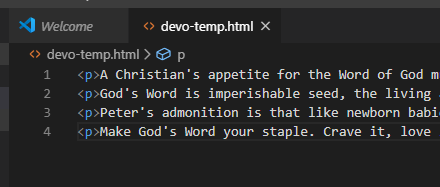
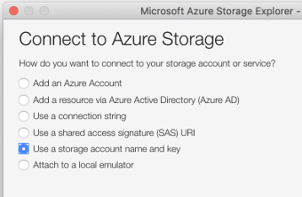
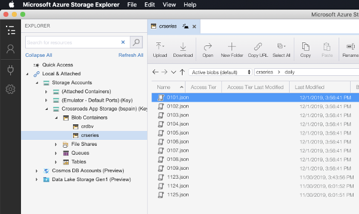

# Creating new Daily Bible Content

## Prerequisites
Make sure you can run the utility scripts in `util/cli`

```
util/cli$ yarn install
util/cli$ yarn start
``` 

If you see the help description for the CLI, you should be good to go.


## Create a New Day Data File
Copy from /data/series/daily/template.json to month date entry

```
~/Projects/crlife-series/data/series/daily $ cp template.json 1123.json
```

Edit `subtitle` by setting the correct Month and Day reference (e.g. "January 4th")


## Convert Devotion Content and Insert into File

Find daily content on 
	
https://www.churchofthehighlands.com/bible
		
	https://www.churchofthehighlands.com/bible/[month]/[day]
			E.g. 
    https://www.churchofthehighlands.com/bible/11/23
			
		
Copy content from "Devotional" into a temp file, use editor to encode html accordingly (usually just "<"p">" tags)


		
Use CLI `devotion` tool to write devo content into daily .json entry

`-s source file` (fragement created above)

`-f target file` (daily entry .json file created above)

```	
~/Projects/crlife-series/util/cli $ yarn start devotion -f ../../data/series/daily/1123.json -s ../../../../devo-temp.html
```

## Passage Fetch, Convert and Import into New Day

Note the passage references in https://www.churchofthehighlands.com/bible
	
Convert the bible reference in an API.NLT.TO query (the 'book' name might be different) - see [NLT API Notes](./NLT_API.md)
	
```
1 Peter 1:13-2:10   => 'Peter.1:13-2:10'
2 Corinthians 1:1-5  => '2Cor.1:1-5'
```
		
Use the CLI `passage` module to write the bible content into the daily.json entry

`-f target file` (daily entry .json file)

`-p pass entry [ 'nt-passage' | 'ot-passage' | 'ps-passage' | 'pr-passage' ]`

`-r bible reference` : e.g. "Peter.1:13-2:10"

For the CLI `passages` module to work, you will first need to the the `NLT_KEY` environment variable.

```
$ export NLT_KEY=<nlt_key>
```
The key should be available from our team Slack.

```
~/Projects/crlife-series/util/cli $ yarn start passage -f ../../data/series/daily/1123.json -p "nt-passage" -r 'Peter.1:13-2:10'
```
		
Repeat for `ot-passage`, `nt-passage`, `ps-passage`, `pr-passage` accordingly

## Upload new Day data file into Azure

Download Azure Storage Explorer
https://azure.microsoft.com/en-us/features/storage-explorer/

Create a connection using "Use a storage account name and key"


On *Connect with Name and Key*

- Display Name: Whatever you want... *"e.g. Crossroads App Storage (bspain)"*

- Account name: *See our Slack room*

- Account key: *See our Slack room*

### Location for CRLife-Series app data
Data files for the app are stored as `.json` at

```
Blob Containers -> crseries -> daily
```
	
With the folder open in the Storage Explorer, you can drag/drop files into the container




## Edit 'meta.json' to include the New Day

Once you have uploaded your day(s) into Azure storage, add the new fragment to `meta.json` and commit/make a pull request for changes.  (The app will only load files that are referenced in `meta.json`)

